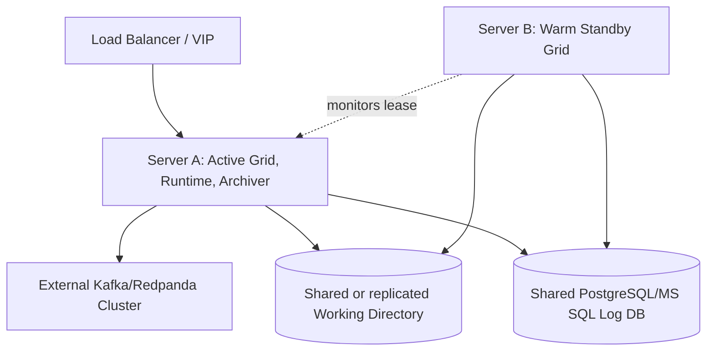

# HA Deployment

Linkiir uses a true active-passive service-tier design.

## Normal state

- Active Grid serves users and supervises Runtime and Archiver.
- Standby Grid monitors the active lease but does not run Runtime or Archiver.
- The queue cluster operates independently.

## Failover

When the active server fails, the standby acquires the lease, starts Runtime and Archiver, and becomes healthy for the load balancer. The Archiver resumes from committed queue offsets; Kafka/Redpanda retains records during the gap.

## Requirements

- Avoid split brain with a reliable lease or fencing mechanism.
- Share or replicate the Linkiir working directory.
- Use the same master encryption key on both nodes.
- Use PostgreSQL or MS SQL, not SQLite, for shared production logging.
- Test failover, failback, and recovery under load.
- Ensure broker replication is independently resilient.
